# TryHackMe - Bounty Hacker Writeup

[Link : https://tryhackme.com/room/cowboyhacker](https://tryhackme.com/room/cowboyhacker)

## Enumeration

First, let’s do an enumeration with the IP address of this machine. I’m gonna run Nmap [Netwok Mapper] to scan any open ports. I’m gonna run this command

```
nmap -sC -sV -oN nmap/initial <machine ip>
```

### Explaining the nmap scan:
* -sC	:= scan using nmap default script
* -sV	:= scan for version
* -oN := output in normal format

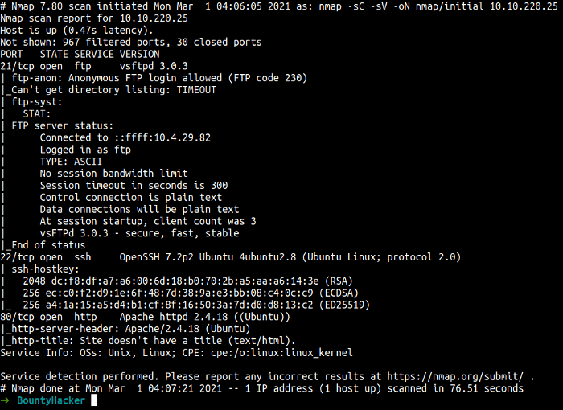

Now, the Nmap scan it’s done. We have 3 open ports FTP, ssh, and HTTP. In this scan, Nmap says FTP can log in as anonymous. Let’s try it

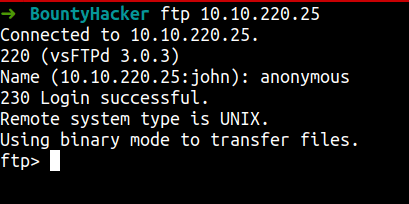

wow! it is working. Now, let’s play around with this and try to find the interesting file.

OK. I just found 2 files in this thing. So, I’m gonna use the gets command to download that file into my machine. Let’s check that file out.

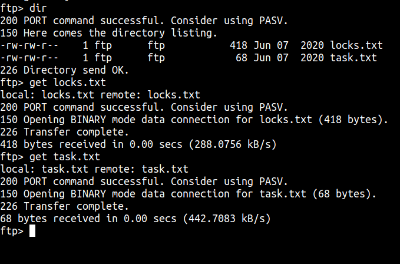

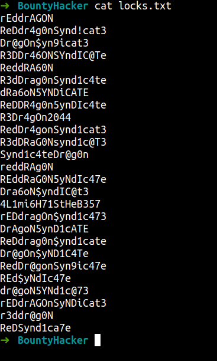<br>
_locks.txt_

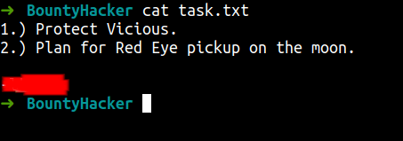<br>
_task.txt_

The file called locks.txt look like wordlist and we’ve got a potential user in the task.txt

Now, we just have one port to go. It is port 80. Now, let’s do enumeration against this website

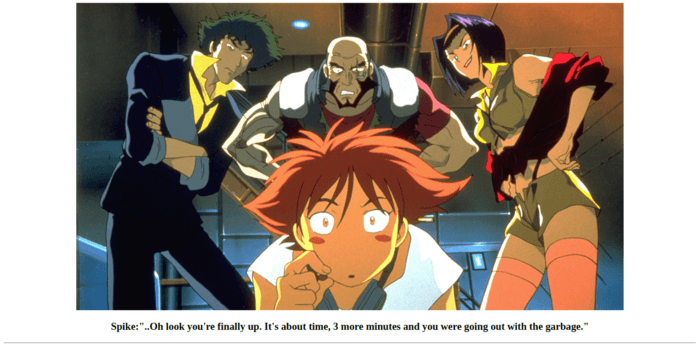

However, I can’t find anything useful. So, I’m gonna run the tool called gobuster to find the hidden directory on this website. Unfortunately, I still can’t find anything.

## Foothold/Gaining Access

This leaves me with the 2 files from FTP earlier. Now, let’s try brute force ssh with these credentials. I’m gonna use hydra for this

```
hydra -l <username> -P <password-list> ssh://<machine ip>
```

In this case, I’m gonna use locks.txt as password list and user that I found in the task.txt file.

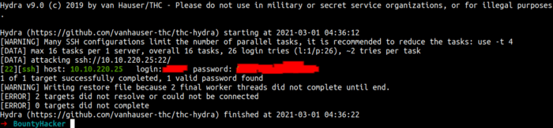

We’ve got a hit. Let’s access the machine now. Yes! we finally gain a foothold on this machine. Now, let’s get our user flag.

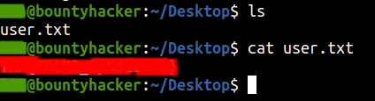

## Privilege Escalation

Now, we need to do the basic enumeration. First, I’m gonna check user sudo permission/capability

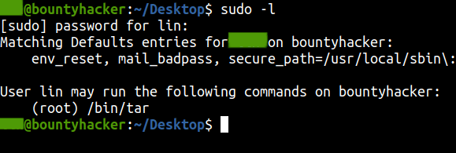

As we see, this user can run tar as root. Let’s try to find an exploit. I’m gonna search for that on the famous website called [GTFOBins](https://gtfobins.github.io/).

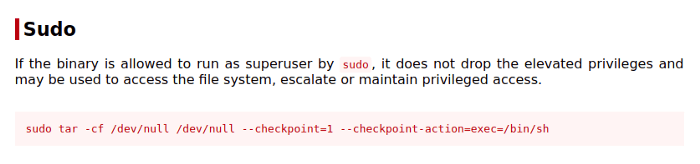

Now let’s copy and paste it into our victim machine.
wow! we just became root just like that. Let’s find the root flag.

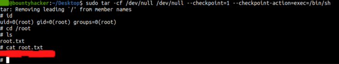

## Conclusion

I’ve learned a lot today. The tool called hydra can brute force the ssh [Secure Shell] with ease. Do not allow anonymous login out in the open. It’s so dangerous. Even the Nmap can found that. Lastly, just don’t mix up command with user and root.

This room so much fun and I hope you guys have fun and learn something new today.
