# TryHackMe - Brooklyn99 Writeup


[Link : https://tryhackme.com/room/brooklynninenine](https://tryhackme.com/room/brooklynninenine)

## [The First Method]

### Enumeration

First, let’s do an enumeration with the IP address of this machine. I’m gonna run Nmap [Netwok Mapper] to scan any open ports. I’m gonna run this command

```bash
nmap -sC -sV -oN nmap/initial <machine ip>
```

### Explaining the nmap scan:
* -sC	:= scan using nmap default script
* -sV	:= scan for version
* -oN := output in normal format

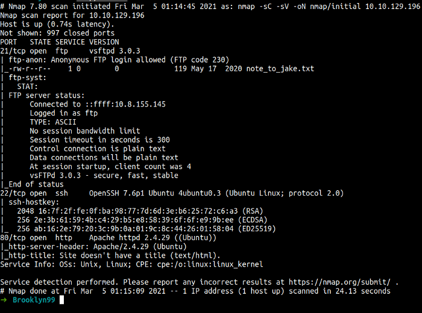

Nmap scan shows us there is 3 port open. Ports SSH, HTTP, and FTP. I’m interested in the FTP port. You can see, FTP in this machine allows anonymous login. So, let’s try to check it out.

```bash
ftp <machine ip>
```

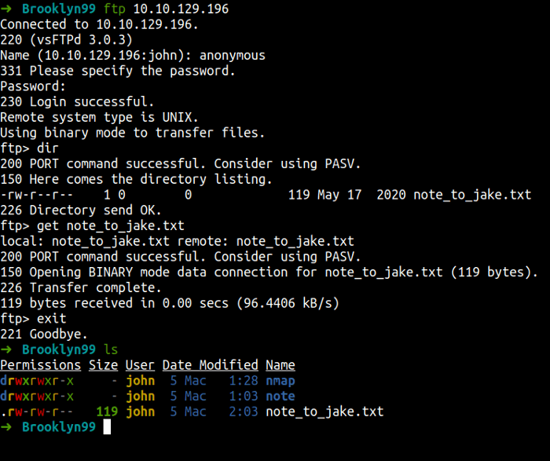

wow! it is working. We can see the `note_to_jake.txt` file in there. Now, I’m gonna run the get command to download that file into my machine. Let’s see what’s the content of this file.

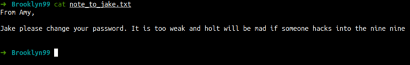

We know that the jake user has a password problem. In this case, we kinda have a potential user at this point. So, I’m gonna try to SSH brute-force with hydra. Remember! the jake user has a password problem. It worth taking a look at.

```
hydra ssh://10.10.129.196 -l jake -P /path/to/wordlist.txt
```

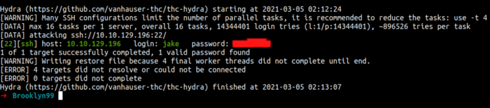

### Foothold/Gaining Access

Let’s try login as jake with that credentials. Yes! We, finally login.

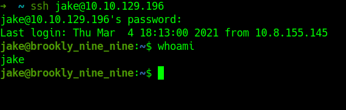

First, I’m run the `ls -la` command to list all/hidden in the current directory. To be honest, I’m shocked because I can’t find the user flag. Now, I’m gonna list the `/home` directory to make sure how many users exist on this machine.

Finally, I’m found the user flag.

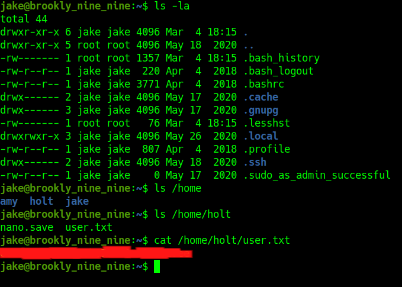

### Privilege Escalation

First, what I like to do is run the `sudo -l` command to check sudo permission/capability.

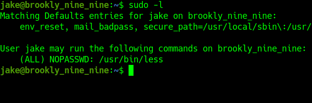

OK! that’s dope. This user can run the `less command with sudo`. I’m gonna search less exploit to privilege escalation on this site [GTFOBins](https://gtfobins.github.io/#).

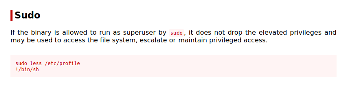

Let’s become root now!. *happy face*

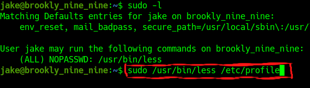

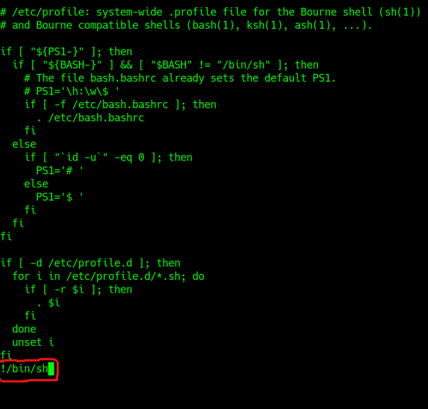

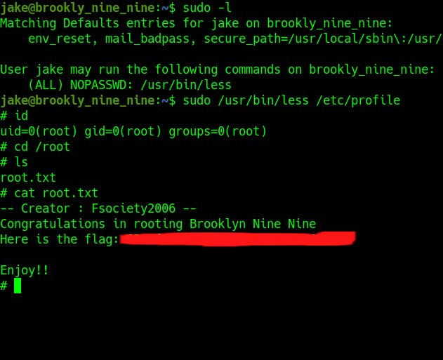

This is the end of 1st method. Let’s try another method

<hr>

## [The Second Method]

### Enumeration

First, let’s do an enumeration with the IP address of this machine. I’m gonna run Nmap [Netwok Mapper] to scan any open ports. I’m gonna run this command

```
nmap -sC -sV -oN nmap/initial <machine ip>
```

### Explaining the nmap scan:
* -sC	:= scan using nmap default script
* -sV	:= scan for version
* -oN := output in normal format


Nmap scan shows us there is 3 port open. Ports SSH, HTTP, and FTP. I’m interested in the FTP port. You can see, FTP in this machine allows anonymous login. So, let’s try to check it out.

```
ftp <machine ip>
```


wow! it is working. We can see the `note_to_jake.txt` file in there. Now, I’m gonna run the get command to download that file into my machine. Let’s see what’s the content of this file.


Now, we got a lot of potential users here. Anyways, We can see the Nmap result shows us this machine have port 80 running HTTP. Let’s take a look.


This is the very first thing I’m gonna do. You always need to check the page source code maybe we can find something interesting. Well, yes we did.

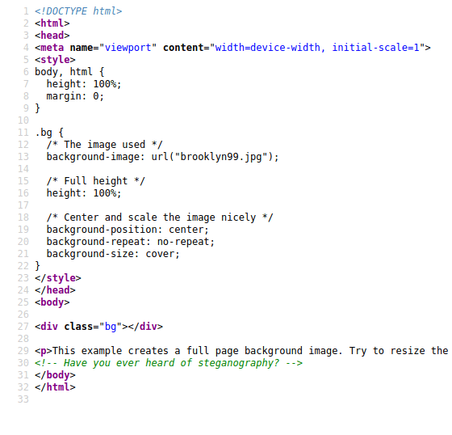

That’s weird. We can see the comment says `‘Have you ever heard of steganography?’`. Let’s try to find out what is steganography.

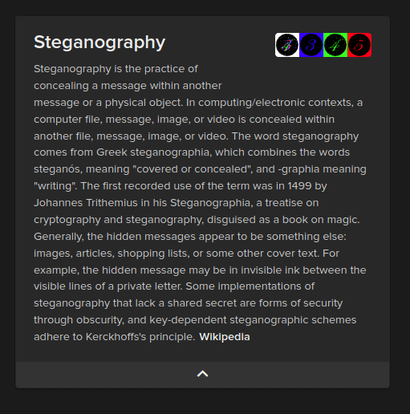

So, I’m gonna download this image and try to crack it. First, I’ll try running info using a tool called steghide. Unfortunately, this image is password protected. However, we have a tool to crack it. This tool is called [stegseek](https://github.com/RickdeJager/stegseek). WOW!!! we succeed to crack it.

```
stegseek -sf  -wl /path/to/wordlist.txt
```

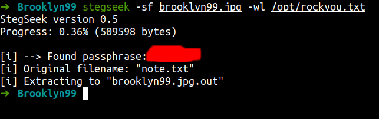

We can see, it says extracting to `brooklyn99.jpg.out`. Now, let’s read the file content.

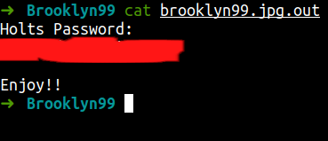

### Foothold/Gaining Access

That wasn’t expecting at all. We’ve just found the holt user password. Well, let’s try login into SSH with those credentials. FINALLY!!!!! WE’RE IN.

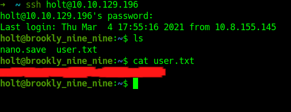

### Privilege Escalation

First, what I like to do is run the `sudo -l` command to check sudo permission/capability.

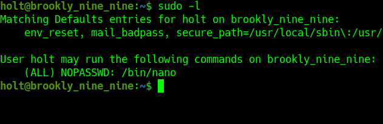

Again. Let’s check out any sudo nano exploit in [GTFOBins](https://gtfobins.github.io/gtfobins/nano/#sudo)

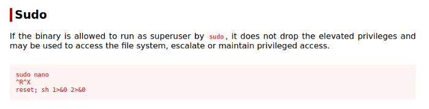

First, open the nano text editor. Then, you need to go to the `‘Read File’` command and the `‘Execute command’`. However, in this case, I’m not gonna run the command provide by GTFOBins because it’s crash my shell. Anyways, I’m gonna set `/bin/bash as SUID`.

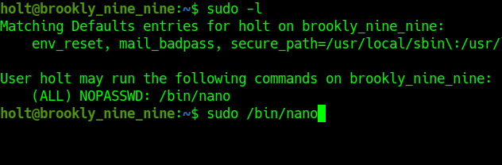<br>
_open the nano text editor_

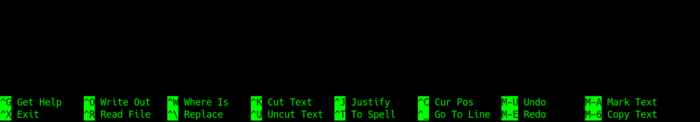<br>
_press the Ctrl+R_

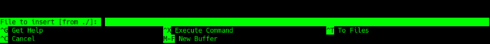<br>
_press the Ctrl+X_

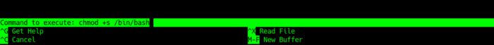<br>
_set the /bin/bash as SUID_

After done set the `/bin/bash` just press `Enter` and exit out of nano `Ctrl+X`.
Now, run this command `/bin/bash -p` we’re now root.

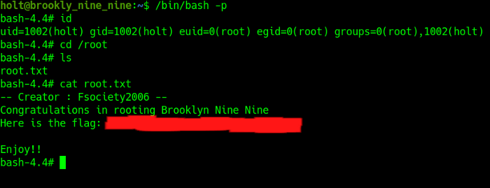

This is the end of 2 method. I hope you enjoy this room as I did. Well, bye2.

## Conclusion

I’ve learned a lot today. First, do not ever make FTP can log in as anonymous and do not ever put any sensitive data/file in it. Make sure your account is protected by a strong, long, and complicated password. Before I forgot, configure the sudo command properly because that’s an OP command.

This room so much fun and I hope you guys have fun and learn something new today.
